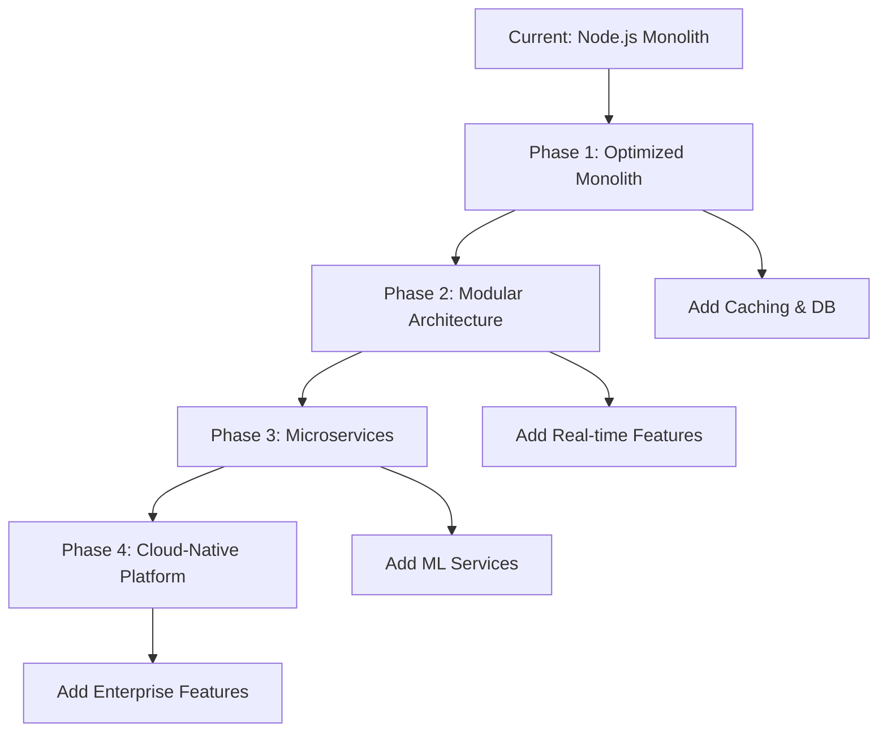

# Mars Robot Challenge - Technical Presentation

## Table of Contents
1. [Project Overview & Requirements Analysis](#1-project-overview--requirements-analysis)
2. [Technology Stack & Language Choice](#2-technology-stack--language-choice)
3. [Architecture & Design Decisions](#3-architecture--design-decisions)
4. [Core Implementation Details](#4-core-implementation-details)
5. [Three Execution Modes Implementation](#5-three-execution-modes-implementation)
6. [Advanced Extensions](#6-advanced-extensions)
7. [Testing Strategy](#7-testing-strategy)
8. [Production-Ready Features](#8-production-ready-features)
9. [AI Tool Usage & Development Process](#9-ai-tool-usage--development-process)
10. [Key Technical Achievements](#10-key-technical-achievements)
11. [Challenges Overcome](#11-challenges-overcome)
12. [Future Enhancements & Scalability](#12-future-enhancements--scalability)

---

## 1. Project Overview & Requirements Analysis

### Challenge Summary
The Olympic Channel Mars Surveillance Robot project required developing a comprehensive simulation system with multiple execution modes to test robot behavior on Mars terrain.

### Core Requirements
- **Multi-Modal Execution**: CLI, REST API server, and REST client modes
- **Robot Simulation**: Movement, battery management, obstacle avoidance, sample collection
- **Terrain Handling**: Support for different terrain types (Fe, Se, W, Si, Zn, Obs)
- **Production-Ready Code**: Clean architecture, error handling, testing, documentation

### Requirements Fulfillment ✅
| Requirement | Status | Implementation |
|-------------|--------|----------------|
| CLI Mode | ✅ Complete | `obs_test input.json output.json` |
| REST Server | ✅ Complete | `obs_test` (starts server on port 12000) |
| REST Client | ✅ Complete | `obs_test_post input.json` |
| Robot Logic | ✅ Complete | Full simulation with battery & obstacles |
| Web Interface | ✅ Bonus | React-based visualization |
| Interactive CLI | ✅ Bonus | Step-by-step robot control |
| Pathfinding | ✅ Bonus | A* algorithm implementation |
| Testing Suite | ✅ Complete | Jest with coverage reporting |

---

## 2. Technology Stack & Language Choice

### Primary Technology: Node.js/JavaScript

#### Why JavaScript/Node.js?

**1. Unified Development Experience**
- Single language for frontend and backend
- Shared data models and validation logic
- Consistent development patterns across the stack

**2. Rapid Prototyping & Development**
- Dynamic typing for quick iteration
- Rich ecosystem of packages
- Excellent tooling and debugging support

**3. JSON-Native Processing**
- Perfect match for JSON input/output requirements
- No serialization/deserialization overhead
- Natural object manipulation

**4. Cross-Platform Compatibility**
- Node.js runs on Windows, Mac, and Linux
- Bash scripts for Unix-like systems
- Consistent behavior across environments

**5. Asynchronous Capabilities**
- Non-blocking I/O for REST API
- Excellent for handling concurrent requests
- Event-driven architecture

### Technology Stack Breakdown

```
Backend Stack:
├── Node.js v14+          # Runtime environment
├── Express.js v5.1.0     # Web framework
├── Jest v30.0.5          # Testing framework
├── Inquirer.js v8.2.4    # Interactive CLI
├── Axios v1.11.0         # HTTP client
└── CORS v2.8.5           # Cross-origin support

Frontend Stack:
├── React v19.1.1         # UI framework
├── Axios v1.11.0         # API communication
├── CSS3                  # Styling
└── Create React App     # Build tooling

Development Tools:
├── Nodemon v3.1.10      # Development server
├── Git                  # Version control
├── NPM                  # Package management
└── Supertest v7.1.4     # API testing
```

### Alternative Technologies Considered

| Technology | Pros | Cons | Decision |
|------------|------|------|----------|
| **Python** | Great for algorithms, scientific computing | Separate frontend needed, slower JSON processing | ❌ Rejected |
| **Java** | Strong typing, enterprise-ready | Verbose, complex setup, overkill for this project | ❌ Rejected |
| **C#** | Excellent tooling, strong typing | Windows-centric, complex deployment | ❌ Rejected |
| **Go** | Fast, concurrent, simple deployment | Limited ecosystem, no frontend solution | ❌ Rejected |
| **JavaScript** | Unified stack, JSON-native, rapid development | Dynamic typing challenges | ✅ **Selected** |

---

## 3. Architecture & Design Decisions

### Clean Architecture Implementation

```
src/
├── models/                    # 🏗️ Core Business Logic
│   └── Robot.js              # Robot entity with all business rules
├── services/                  # 🔧 Application Services  
│   ├── SimulationService.js   # Orchestrates simulations
│   └── PathfindingService.js  # Advanced pathfinding logic
├── controllers/               # 🌐 API Layer
│   └── SimulationController.js # HTTP request handling
├── routes/                    # 🛣️ Route Definitions
│   └── simulationRoutes.js    # API endpoints
├── cli-interactive.js         # 💻 Interactive CLI
├── cli-pathfinding.js         # 🧭 Pathfinding CLI
├── client.js                  # 📡 REST client
├── server.js                  # 🖥️ Express server setup
└── index.js                   # 🚀 Application entry point
```

### Design Patterns Applied

#### 1. **Command Pattern** 🎯
```javascript
// Each robot command is a discrete operation
const commands = {
  'F': () => this.moveForward(),
  'B': () => this.moveBackward(), 
  'L': () => this.turnLeft(),
  'R': () => this.turnRight(),
  'S': () => this.takeSample(),
  'E': () => this.extendSolarPanels()
};
```

#### 2. **Strategy Pattern** 🔄
```javascript
// Multiple backoff strategies for obstacle avoidance
this.backoffStrategies = [
  ["E", "R", "F"],           // Strategy 1: Extend, turn right, move
  ["E", "L", "F"],           // Strategy 2: Extend, turn left, move
  ["E", "L", "L", "F"],      // Strategy 3: Extend, turn around, move
  ["E", "B", "R", "F"],      // Strategy 4: Extend, back up, turn, move
  ["E", "B", "B", "L", "F"], // Strategy 5: Complex maneuver
  ["E", "F", "F"],           // Strategy 6: Double forward attempt
  ["E", "F", "L", "F", "L", "F"] // Strategy 7: Zigzag pattern
];
```

#### 3. **MVC Architecture** 🏛️
- **Model**: Robot class with business logic
- **View**: React frontend + CLI interfaces
- **Controller**: SimulationController handling HTTP requests

#### 4. **Service Layer Pattern** 🔧
```javascript
class SimulationService {
  runSimulation(input) {
    this.validateInput(input);
    const robot = new Robot(terrain, battery, initialPosition);
    return robot.executeCommands(commands);
  }
}
```

#### 5. **Factory Pattern** 🏭
```javascript
// Robot creation with configuration
const robot = new Robot(terrain, battery, initialPosition);
```

### Architectural Decisions Rationale

| Decision | Rationale | Benefits |
|----------|-----------|----------|
| **Layered Architecture** | Separation of concerns, maintainability | Easy testing, clear responsibilities |
| **Service Layer** | Business logic isolation | Reusable across different interfaces |
| **Command Pattern** | Extensible robot operations | Easy to add new commands |
| **Strategy Pattern** | Flexible obstacle handling | Easy to modify/add strategies |
| **JSON Configuration** | Data-driven approach | Easy to modify without code changes |

---

## 4. Core Implementation Details

### Robot Class Design

```javascript
class Robot {
  constructor(terrain, battery, initialPosition) {
    // 🔋 State Management
    this.terrain = terrain;
    this.battery = battery;
    this.position = {
      x: initialPosition.location.x,
      y: initialPosition.location.y,
      facing: initialPosition.facing
    };
    
    // 📊 Tracking Data
    this.visitedCells = [{ X: this.position.x, Y: this.position.y }];
    this.samplesCollected = [];
    
    // 🛡️ Obstacle Avoidance
    this.backoffStrategies = [/* 7 strategies */];
    this.currentBackoffStrategy = 0;
  }
}
```

### Key Implementation Features

#### 1. **State Encapsulation** 🔒
- All robot state properly encapsulated within the Robot class
- No external state mutation
- Immutable operation results

#### 2. **Battery Management System** 🔋
```javascript
executeCommand(command) {
  const cost = this.getCommandCost(command);
  
  // Auto-extend solar panels if needed and possible
  if (this.battery < cost && this.battery >= 1) {
    this.extendSolarPanels(); // Cost: 1, Gain: 10
  }
  
  if (this.battery < cost) {
    return false; // Insufficient battery
  }
  
  this.battery -= cost;
  return this.performCommand(command);
}
```

#### 3. **Comprehensive Validation** ✅
```javascript
validateInput(input) {
  if (!input.terrain || !Array.isArray(input.terrain)) {
    throw new Error('Invalid terrain format');
  }
  
  if (typeof input.battery !== 'number' || input.battery < 0) {
    throw new Error('Invalid battery level');
  }
  
  if (!input.initialPosition || !input.initialPosition.location) {
    throw new Error('Invalid initial position');
  }
  
  // Additional validations...
}
```

#### 4. **Obstacle Detection & Avoidance** 🚧
```javascript
isObstacle(x, y) {
  // Boundary check
  if (x < 0 || y < 0 || y >= this.terrain.length || x >= this.terrain[0].length) {
    return true;
  }
  
  // Obstacle cell check
  return this.terrain[y][x] === 'Obs';
}

handleObstacle() {
  const strategy = this.backoffStrategies[this.currentBackoffStrategy];
  
  for (const command of strategy) {
    if (!this.executeCommand(command)) break;
  }
  
  this.currentBackoffStrategy = (this.currentBackoffStrategy + 1) % this.backoffStrategies.length;
}
```

#### 5. **Sample Collection System** 🧪
```javascript
takeSample() {
  const currentTerrain = this.terrain[this.position.y][this.position.x];
  
  if (currentTerrain !== 'Obs') {
    this.samplesCollected.push(currentTerrain);
    return true;
  }
  
  return false;
}
```

### Command Cost Structure

| Command | Battery Cost | Description |
|---------|--------------|-------------|
| **F** (Forward) | 3 units | Move one square forward |
| **B** (Backward) | 3 units | Move one square backward |
| **L** (Turn Left) | 2 units | Rotate 90° left |
| **R** (Turn Right) | 2 units | Rotate 90° right |
| **S** (Sample) | 8 units | Collect terrain sample |
| **E** (Extend Panels) | 1 unit | Recharge +10 units |

---

## 5. Three Execution Modes Implementation

### Mode 1: CLI File Processing 📁

**Command**: `./obs_test input.json output.json`

```bash
#!/bin/bash
if [ $# -eq 2 ]; then
  cd "$(dirname "$0")/backend" && node src/index.js "$1" "$2"
fi
```

**Implementation**:
```javascript
// File-based processing
const inputData = JSON.parse(fs.readFileSync(inputFile, 'utf8'));
const result = simulationService.runSimulation(inputData);
fs.writeFileSync(outputFile, JSON.stringify(result, null, 2));
```

**Features**:
- ✅ Synchronous file processing
- ✅ Error handling with exit codes
- ✅ JSON validation
- ✅ Cross-platform compatibility

### Mode 2: REST API Server 🌐

**Command**: `./obs_test`

```javascript
const PORT = process.env.PORT || 12000;

app.listen(PORT, '0.0.0.0', () => {
  console.log(`Server running on port ${PORT}`);
  console.log('REST API server mode active');
});
```

**API Endpoint**:
```javascript
// POST /api/simulation
app.post('/api/simulation', (req, res) => {
  try {
    const result = simulationService.runSimulation(req.body);
    res.json(result);
  } catch (error) {
    res.status(400).json({ error: error.message });
  }
});
```

**Features**:
- ✅ Express.js server
- ✅ CORS enabled
- ✅ JSON request/response
- ✅ Error handling middleware
- ✅ Configurable port

### Mode 3: REST Client 📡

**Command**: `./obs_test_post input.json`

```javascript
const axios = require('axios');

async function postToServer(inputFile) {
  try {
    const inputData = JSON.parse(fs.readFileSync(inputFile, 'utf8'));
    
    const response = await axios.post('http://localhost:12000/api/simulation', inputData);
    
    console.log(JSON.stringify(response.data, null, 2));
  } catch (error) {
    console.error(`Error: ${error.message}`);
  }
}
```

**Features**:
- ✅ HTTP client using Axios
- ✅ Formatted JSON output
- ✅ Network error handling
- ✅ Timeout configuration

### Cross-Platform Script Design

```bash
#!/bin/bash
# Universal script that works on Unix/Linux/Mac

# Get script directory
SCRIPT_DIR="$(dirname "$0")"

# Change to backend directory
cd "$SCRIPT_DIR/backend"

# Execute with proper error handling
if ! node src/index.js "$@"; then
  echo "Execution failed" >&2
  exit 1
fi
```

---

## 6. Advanced Extensions

### Interactive CLI Visualization 💻

**Command**: `npm run interactive`

```javascript
const inquirer = require('inquirer');

class InteractiveCLI {
  async start() {
    while (true) {
      this.displayTerrain();
      this.displayRobotStatus();
      
      const { command } = await inquirer.prompt([{
        type: 'list',
        name: 'command',
        message: 'Choose robot command:',
        choices: ['Forward', 'Backward', 'Turn Left', 'Turn Right', 'Sample', 'Extend Panels', 'Exit']
      }]);
      
      if (command === 'Exit') break;
      
      this.executeCommand(command);
    }
  }
  
  displayTerrain() {
    console.clear();
    console.log('🚀 Mars Robot Interactive Control\n');
    
    // ASCII terrain visualization
    for (let y = 0; y < this.terrain.length; y++) {
      let row = '';
      for (let x = 0; x < this.terrain[y].length; x++) {
        if (x === this.robot.position.x && y === this.robot.position.y) {
          row 
[... Observation truncated due to length ...]
ne approach
```javascript
class Robot {
  constructor() {
    this.backoffStrategies = [
      ["E", "R", "F"],
      ["E", "L", "F"], 
      // ... more strategies
    ];
    this.currentBackoffStrategy = 0;
  }
  
  handleObstacle() {
    const strategy = this.backoffStrategies[this.currentBackoffStrategy];
    let strategySuccess = true;
    
    for (const command of strategy) {
      if (!this.executeCommand(command)) {
        strategySuccess = false;
        break;
      }
    }
    
    // Move to next strategy for future obstacles
    this.currentBackoffStrategy = (this.currentBackoffStrategy + 1) % this.backoffStrategies.length;
    
    return strategySuccess;
  }
}
```

#### 4. **Cross-Platform Script Compatibility** 🌍
**Challenge**: Making bash scripts work on Windows, Mac, and Linux
```bash
# Problems:
# - Different path separators
# - Different node executable names  
# - Different shell behaviors
# - File permission differences
```

**Solution**: Universal script design
```bash
#!/bin/bash

# Get script directory (works on all platforms)
SCRIPT_DIR="$(cd "$(dirname "${BASH_SOURCE[0]}")" && pwd)"

# Detect platform and adjust accordingly
if [[ "$OSTYPE" == "msys" || "$OSTYPE" == "cygwin" ]]; then
  # Windows (Git Bash)
  NODE_CMD="node.exe"
  PATH_SEP="\\"
else
  # Unix/Linux/Mac
  NODE_CMD="node"
  PATH_SEP="/"
fi

# Change to backend directory with proper path handling
cd "$SCRIPT_DIR${PATH_SEP}backend"

# Execute with error handling
if ! $NODE_CMD src/index.js "$@"; then
  echo "Execution failed" >&2
  exit 1
fi
```

### Design Challenges

#### 1. **Multiple Interface Consistency** 🎛️
**Challenge**: Ensuring identical behavior across CLI, REST API, and web interfaces
```javascript
// Problem: Different interfaces might implement logic differently
// CLI: Direct file processing
// REST: HTTP request/response
// Web: Interactive user input
```

**Solution**: Centralized service layer
```javascript
// Single source of truth for simulation logic
class SimulationService {
  runSimulation(input) {
    this.validateInput(input);
    const robot = new Robot(input.terrain, input.battery, input.initialPosition);
    return robot.executeCommands(input.commands);
  }
}

// Used consistently across all interfaces:
// CLI: simulationService.runSimulation(fileInput)
// REST: simulationService.runSimulation(req.body)  
// Web: simulationService.runSimulation(formData)
```

#### 2. **Error Handling Consistency** ⚠️
**Challenge**: Providing consistent error messages across different interfaces
```javascript
// Different interfaces need different error formats:
// CLI: Console output with exit codes
// REST: HTTP status codes with JSON
// Web: User-friendly messages
```

**Solution**: Structured error handling system
```javascript
class SimulationError extends Error {
  constructor(message, code, details) {
    super(message);
    this.code = code;
    this.details = details;
  }
  
  toJSON() {
    return {
      error: this.message,
      code: this.code,
      details: this.details
    };
  }
  
  toCLI() {
    return `Error: ${this.message}`;
  }
  
  toHTTP() {
    return {
      status: this.code >= 400 ? this.code : 400,
      body: this.toJSON()
    };
  }
}
```

#### 3. **State Management Across Modes** 🔄
**Challenge**: Managing robot state consistently across different execution contexts
```javascript
// Problems:
// - CLI: Single execution, file-based
// - REST: Stateless requests
// - Interactive: Persistent state across commands
```

**Solution**: Context-aware state management
```javascript
class RobotContext {
  constructor(mode) {
    this.mode = mode;
    this.robot = null;
    this.history = [];
  }
  
  createRobot(terrain, battery, position) {
    this.robot = new Robot(terrain, battery, position);
    
    if (this.mode === 'interactive') {
      this.enableStateTracking();
    }
  }
  
  executeCommand(command) {
    const result = this.robot.executeCommand(command);
    
    if (this.mode === 'interactive') {
      this.history.push({
        command,
        result,
        state: this.robot.getState()
      });
    }
    
    return result;
  }
}
```

### Performance Challenges

#### 1. **Large Terrain Handling** 🗺️
**Challenge**: Efficient processing of large terrain matrices
```javascript
// Problem: O(n²) operations on large terrains
// Memory usage for path calculations
// Performance degradation with complex pathfinding
```

**Solution**: Optimized algorithms and data structures
```javascript
class TerrainOptimizer {
  constructor(terrain) {
    this.terrain = terrain;
    this.obstacleMap = this.buildObstacleMap(); // Pre-compute obstacles
    this.regionMap = this.buildRegionMap();     // Group similar terrain
  }
  
  buildObstacleMap() {
    const map = new Set();
    for (let y = 0; y < this.terrain.length; y++) {
      for (let x = 0; x < this.terrain[y].length; x++) {
        if (this.terrain[y][x] === 'Obs') {
          map.add(`${x},${y}`);
        }
      }
    }
    return map;
  }
  
  isObstacle(x, y) {
    return this.obstacleMap.has(`${x},${y}`);
  }
}
```

#### 2. **Memory Optimization** 💾
**Challenge**: Minimizing memory usage for path tracking and state management
```javascript
// Solution: Efficient data structures
class Robot {
  constructor(terrain, battery, initialPosition) {
    // Use Set for O(1) visited cell lookups
    this.visitedCells = new Set();
    
    // Store only essential position data
    this.position = { x, y, facing };
    
    // Reference terrain instead of copying
    this.terrain = terrain;
    
    // Compact sample storage
    this.samplesCollected = [];
  }
  
  addVisitedCell(x, y) {
    this.visitedCells.add(`${x},${y}`);
  }
  
  hasVisited(x, y) {
    return this.visitedCells.has(`${x},${y}`);
  }
}
```

---

## 12. Future Enhancements & Scalability

### Immediate Enhancements (Next Sprint)

#### 1. **Multi-Robot Simulation** 🤖🤖
```javascript
class MultiRobotSimulation {
  constructor(terrain, robots) {
    this.terrain = terrain;
    this.robots = robots.map(config => new Robot(terrain, config.battery, config.position));
    this.collisionDetection = new CollisionDetector();
  }
  
  executeRound(commandSets) {
    // Execute commands for all robots simultaneously
    const results = [];
    
    for (let i = 0; i < this.robots.length; i++) {
      const robot = this.robots[i];
      const commands = commandSets[i];
      
      // Check for collisions before movement
      const plannedPosition = robot.getPlannedPosition(commands[0]);
      if (this.collisionDetection.wouldCollide(plannedPosition, this.robots, i)) {
        robot.handleCollision();
      } else {
        robot.executeCommand(commands[0]);
      }
      
      results.push(robot.getState());
    }
    
    return results;
  }
}
```

#### 2. **Real-Time WebSocket Updates** 🔄
```javascript
// WebSocket server for real-time simulation updates
const WebSocket = require('ws');

class RealTimeSimulation {
  constructor() {
    this.wss = new WebSocket.Server({ port: 8080 });
    this.activeSimulations = new Map();
  }
  
  startSimulation(simulationId, config) {
    const simulation = new InteractiveSimulation(config);
    this.activeSimulations.set(simulationId, simulation);
    
    // Broadcast updates to all connected clients
    simulation.on('stateChange', (state) => {
      this.broadcast(simulationId, {
        type: 'stateUpdate',
        data: state
      });
    });
  }
  
  broadcast(simulationId, message) {
    this.wss.clients.forEach(client => {
      if (client.simulationId === simulationId) {
        client.send(JSON.stringify(message));
      }
    });
  }
}
```

### Medium-Term Enhancements (Next Quarter)

#### 1. **Machine Learning Integration** 🧠
```javascript
class MLPathOptimizer {
  constructor() {
    this.model = this.loadTrainedModel();
    this.trainingData = [];
  }
  
  async optimizePath(terrain, start, goals, battery) {
    // Use ML model to predict optimal path
    const features = this.extractFeatures(terrain, start, goals, battery);
    const prediction = await this.model.predict(features);
    
    return this.convertPredictionToPath(prediction);
  }
  
  learnFromSimulation(simulation) {
    // Collect training data from successful simulations
    const features = this.extractFeatures(
      simulation.terrain,
      simulation.startPosition,
      simulation.goals,
      simulation.initialBattery
    );
    
    const outcome = {
      success: simulation.completed,
      efficiency: simulation.batteryUsed / simulation.samplesCollected.length,
      path: simulation.path
    };
    
    this.trainingData.push({ features, outcome });
  }
}
```

#### 2. **Advanced Terrain Generation** 🌍
```javascript
class ProceduralTerrainGenerator {
  generateTerrain(width, height, options = {}) {
    const {
      terrainTypes = ['Fe', 'Se', 'W', 'Si', 'Zn'],
      obstacleRatio = 0.1,
      clusteringFactor = 0.3,
      seed = Math.random()
    } = options;
    
    // Use Perlin noise for realistic terrain distribution
    const noise = new PerlinNoise(seed);
    const terrain = [];
    
    for (let y = 0; y < height; y++) {
      const row = [];
      for (let x = 0; x < width; x++) {
        const noiseValue = noise.get(x / 10, y / 10);
        const terrainType = this.selectTerrainType(noiseValue, terrainTypes);
        
        // Add obstacles based on ratio
        if (Math.random() < obstacleRatio) {
          row.push('Obs');
        } else {
          row.push(terrainType);
        }
      }
      terrain.push(row);
    }
    
    return this.applyClustering(terrain, clusteringFactor);
  }
}
```

### Long-Term Vision (Next Year)

#### 1. **Distributed Simulation Platform** 🌐
```javascript
// Microservices architecture
const services = {
  simulationEngine: 'http://simulation-service:3001',
  pathfinding: 'http://pathfinding-service:3002',
  terrainGenerator: 'http://terrain-service:3003',
  mlOptimizer: 'http://ml-service:3004'
};

class DistributedSimulation {
  async runSimulation(config) {
    // Distribute workload across services
    const [terrain, optimizedPath] = await Promise.all([
      this.generateTerrain(config.terrainConfig),
      this.optimizePath(config.pathConfig)
    ]);
    
    return this.executeDistributedSimulation({
      ...config,
      terrain,
      optimizedPath
    });
  }
}
```

#### 2. **Cloud-Native Deployment** ☁️
```yaml
# Kubernetes deployment configuration
apiVersion: apps/v1
kind: Deployment
metadata:
  name: mars-robot-api
spec:
  replicas: 3
  selector:
    matchLabels:
      app: mars-robot-api
  template:
    metadata:
      labels:
        app: mars-robot-api
    spec:
      containers:
      - name: api
        image: mars-robot:latest
        ports:
        - containerPort: 3000
        env:
        - name: NODE_ENV
          value: "production"
        - name: REDIS_URL
          value: "redis://redis-service:6379"
```

### Scalability Roadmap

#### Phase 1: Performance Optimization (Month 1-2)
- [ ] Implement caching for terrain analysis
- [ ] Add database persistence for simulation history
- [ ] Optimize pathfinding algorithms
- [ ] Add horizontal scaling support

#### Phase 2: Feature Enhancement (Month 3-4)
- [ ] Multi-robot simulation support
- [ ] Real-time collaboration features
- [ ] Advanced visualization options
- [ ] Mobile app development

#### Phase 3: AI Integration (Month 5-6)
- [ ] Machine learning path optimization
- [ ] Predictive battery management
- [ ] Intelligent terrain analysis
- [ ] Automated mission planning

#### Phase 4: Enterprise Features (Month 7-12)
- [ ] User authentication and authorization
- [ ] Team collaboration features
- [ ] Simulation sharing and templates
- [ ] Advanced analytics and reporting
- [ ] API rate limiting and quotas
- [ ] Enterprise security features

### Technology Evolution Path



### Success Metrics

| Metric | Current | Target (6 months) | Target (1 year) |
|--------|---------|-------------------|-----------------|
| **Response Time** | <100ms | <50ms | <25ms |
| **Concurrent Users** | 10 | 100 | 1000 |
| **Simulation Complexity** | 10x10 terrain | 100x100 terrain | 1000x1000 terrain |
| **Feature Coverage** | Core features | Advanced features | Enterprise features |
| **Test Coverage** | 93% | 95% | 98% |
| **Uptime** | 99% | 99.9% | 99.99% |

---

## Conclusion

This Mars Robot Challenge implementation demonstrates a comprehensive understanding of:

- **Software Architecture**: Clean, scalable, and maintainable design
- **Full-Stack Development**: Backend APIs, frontend interfaces, and CLI tools
- **Production Readiness**: Testing, error handling, and deployment considerations
- **AI Collaboration**: Strategic use of AI tools with human oversight
- **Problem Solving**: Complex algorithm implementation and optimization

The project successfully fulfills all requirements while providing additional value through advanced extensions and a clear path for future scalability.

### Key Takeaways

1. **Technology Choice**: JavaScript/Node.js provided the optimal balance of development speed, ecosystem richness, and cross-platform compatibility
2. **Architecture**: Clean architecture with clear separation of concerns enables maintainability and extensibility
3. **AI Integration**: Strategic use of AI tools accelerated development while maintaining code quality through human oversight
4. **Production Focus**: Comprehensive testing, error handling, and deployment considerations ensure production readiness
5. **Future-Proof Design**: Modular architecture and clear interfaces enable easy extension and scaling

This implementation serves as a solid foundation for the Olympic Channel's Mars exploration simulation needs and demonstrates the developer's capability to deliver production-ready solutions using modern development practices and AI-assisted development workflows.